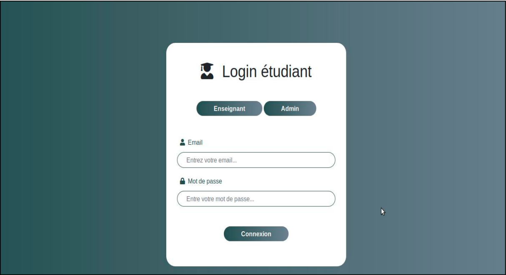
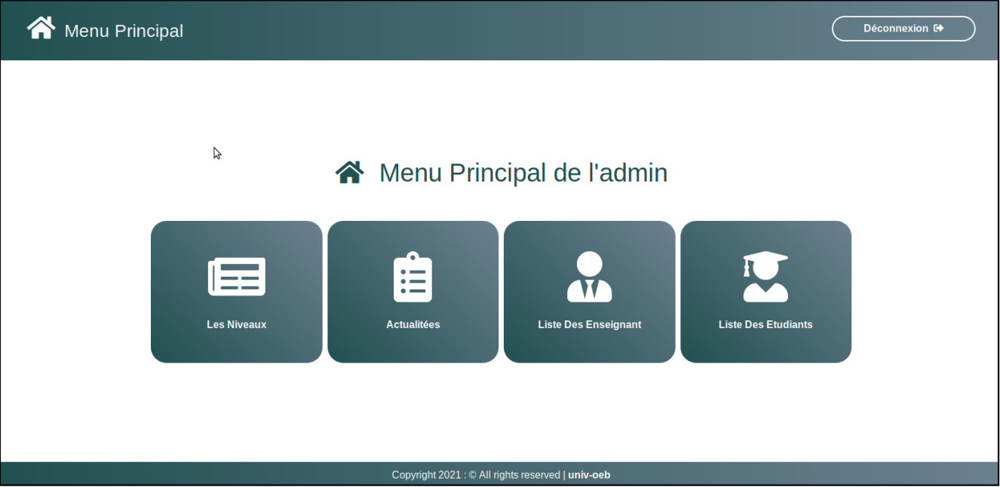
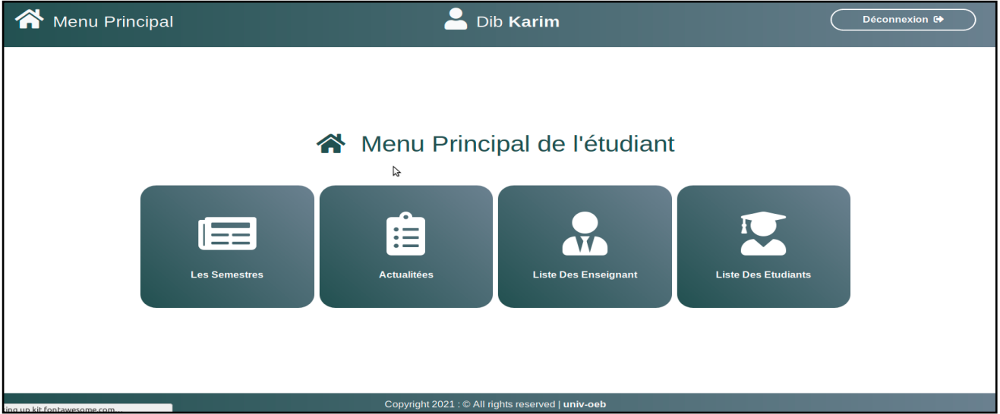
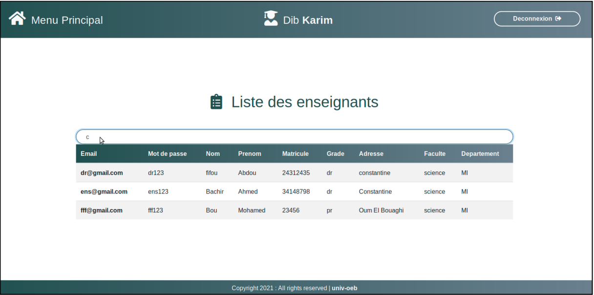
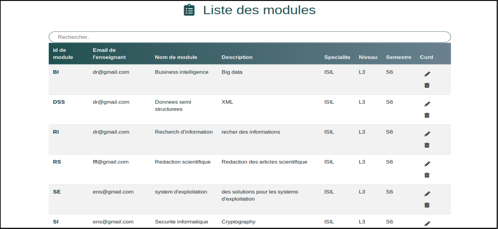
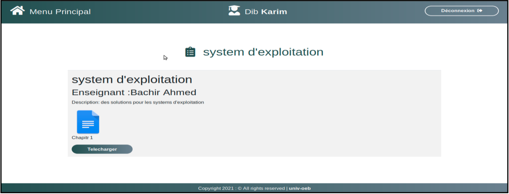

# 🎓 Plateforme E-Learning  

## 📌 Description du Projet  

Ce projet consiste en la conception et le développement d'un **site web dynamique de E-Learning** pour l'université **Larbi Ben M'hidi Oum El Bouaghi**.  
L'objectif est de fournir une plateforme permettant aux enseignants et aux étudiants d'interagir dans un environnement numérique dédié à l'apprentissage à distance.  

Les enseignants peuvent **publier des cours, des interrogations** et consulter les commentaires des étudiants.  
Les étudiants peuvent **suivre les cours, télécharger les documents** et interagir avec les enseignants.  
L'administrateur, quant à lui, gère la plateforme en administrant les comptes des utilisateurs, les annonces, les modules et la maintenance du site.  

---

## 💡 Fonctionnalités  

✅ **Gestion des utilisateurs** (Administrateurs, Enseignants, Étudiants)  
✅ **Publication et gestion des cours**  
✅ **Téléchargement de documents pédagogiques**  
✅ **Système d’interrogation et d’évaluation**  
✅ **Interaction via commentaires**  
✅ **Gestion des modules et des chapitres**  
✅ **Système d’authentification sécurisé**  

---
🚀 **Technologies utilisées :**  
- **Frontend :** HTML, CSS, JavaScript, Bootstrap  
- **Backend :** PHP, SQL  
- **Base de données :** MySQL via PhpMyAdmin  
- **Serveur Local :** XAMPP  

---

## 🛠 Stack Technique  

### 🔹 Langages de Programmation  
- HTML, CSS, JavaScript, Bootstrap (Frontend)  
- PHP, SQL (Backend)  

### 🔹 Outils de Développement  
- **Serveur Local :** XAMPP v3.2.4  
  - Apache 2.0  
  - MySQL 5.7.21  
  - PHP 5.5.35  
  - PhpMyAdmin 4.7.9  
- **IDE & Éditeur :** Notepad++  

---

## 📸 Captures d'Écran  

### 🧑‍🏫 Interface d'Ajout d'un Enseignant  

| Ajout d'un Enseignant |
|----------------------|
|  |

### 🎓 Interface d'Ajout d'un Étudiant  

| Ajout d'un Étudiant |
|----------------------|
|  |

### 🔑 Interface de Connexion  

| Interface Login |
|----------------------|
|  |

### 📚 Interface d'Ajout d'un Module  

| Ajout d'un Module |
|----------------------|
|  |

### 🏠 Interface Home Admin  

| Accueil Admin |
|----------------------|
|  |

### 🏠 Interface Home Étudiant  

| Accueil Étudiant |
|----------------------|
|  |

### 📋 Interface Liste des Enseignants (Vue Étudiant)  

| Liste des Enseignants |
|----------------------|
|  |

### 📚 Interface Liste des Modules  

| Liste des Modules |
|----------------------|
|  |

### 📖 Interface des Chapitres  

| Liste des Chapitres |
|----------------------|
|  |

---
## 📄 Mémoire de Fin d'Études  

Le document suivant est le **mémoire complet** du projet **"Conception et développement d’un site web dynamique de E-Learning"**.  
Il présente l'ensemble des étapes de conception, développement et mise en œuvre de la plateforme E-Learning pour l'université **Larbi Ben M'hidi Oum El Bouaghi**.  

📖 **Titre :** Conception et développement d’un site web dynamique de E-Learning  
🎓 **Présenté par :** Krikou Noureddine, Soualem Maamoune, Bouchama Mounir  
👨‍🏫 **Encadré par :** Dr. Zedairia Abdellah  
📅 **Année universitaire :** 2020-2021  

📥 **Télécharger le mémoire :**  
➡️ [Mémoire de fin d’études (PDF)](docs/memoire_finale_E-learning.pdf)
